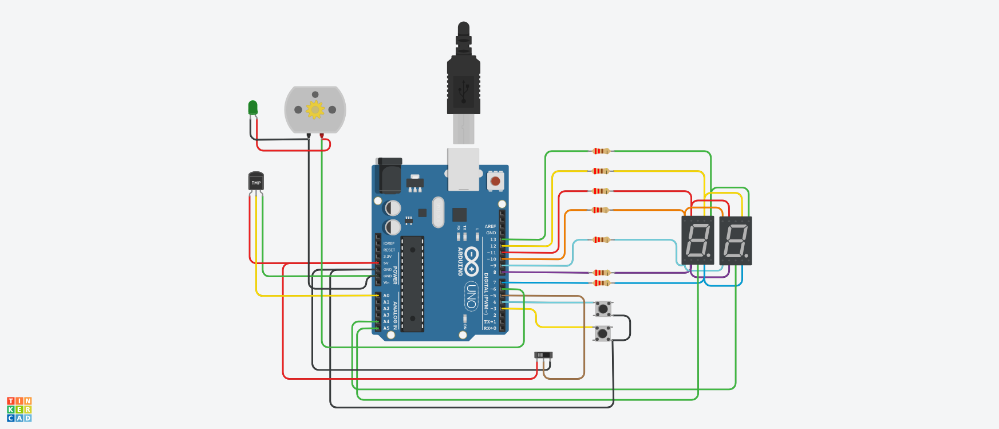
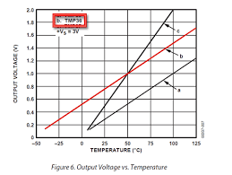

# SPD_2

## Integrantes:
Nicolas Moreyra
Jonathan Murray
Juan Paredes

## Proyecto:
•	Sensor de temperatura, con display y accionador de motor dc.
•	Contador de activación por pulsadores. Cuenta números primos y Cuenta de 0 a 99

## Descripción:
	Mediante la técnica de accionamiento de un interruptor (tipo slideswitch), podemos usar las dos funciones del circuito:
•	Contador de activación por pulsadores. Cuenta números primos del 0 a 99 
•	Contador de activación por pulsadores. Cuenta de 0 a 99
Y además cuenta con un sensor de temperatura TMP36, el cual tomara la temperatura ambiente, y dependiendo de la misma accionara un motor dc de 5V.
Contador de activación por pulsadores. Cuenta de 0 a 99
1-	Mediante la accionamiento de los pulsadores “SUBE” o “BAJA”, se accionara la función ControladorPulsadores() la cual reconocerá cual pulsador fue presionado. 
2-	Una vez identificado en voidloop(), dependiendo si se desea subir o bajar la cuenta del contador, aumentaran en uno o descenderán de uno en uno los contadores. 
3-	Dicho estado del contador seria impreso mediante la función ControlUnidadDecena(). Que en conjunto con las funciones controladorMultiplexado() y controladorDisplay(), se encargaran del multiplexado de los dos display, y de iluminar los segmentos de los displays de acuerdo a la secuencia de numero obtenida.
4-	De esta manera en el display se vera la cuenta del contador, y a medida que se presiona el pulsador de subir o bajar aumentará o descenderá el conteo.
Contador de activación por pulsadores. Cuenta números primos del 0 a 99 
1-	Cuando se deslize el interruptor slideswitch a la posición de 1, el circuito estará listo para comenzar el conteo de números primos
2-	Mediante la accionamiento de los pulsadores “SUBE” o “BAJA”, se accionara la función ControladorPulsadores() la cual reconocerá cual pulsador fue presionado. 
3-	Una vez identificado en voidloop(), por la funcionPrimo() dependiendo si se desea subir o bajar la cuenta del contador, aumentaran en uno o descenderán de uno en uno los contadores de números primos.
4-	La funcionPrimo() identificara si el numero es primo mediante un ciclo while, el cual primero verificara mediante un if si el numero es 0 o 1, para descartarlos. En segundo lugar, realizara otro filtro mediante un ciclo for el cual mediante un contador llamado divisor ira operando mediante % a el contador, que iterara hasta alcanzar al mismo numero. Verificando así todos sus divisores. Cuenta con un if que si el resto de esa operación da 0 no será primo.
5-	La función también identificará si se presiona el pulsador de subir o bajar, para aumentado o disminuyendo en su cuenta de números primos (0 a 99)
6-	Una vez identificado el numero lo devolverá. Todo este reconocimiento en cada etapa lo realizara también una bandera flag_primo
7-	Dicho número será impreso mediante la función ControlUnidadDecena(). Que en conjunto con las funciones controladorMultiplexado() y controladorDisplay(), se encargaran del multiplexado de los dos display, y de iluminar los segmentos de los displays de acuerdo a la secuencia de numero obtenida.
8-	De esta manera en el display se vera la cuenta de números primos, y a medida que se presiona el pulsador de subir o bajar aumentara o descenderá el conteo.

## Medidor de temperatura, con display y accionador de motor dc.
1-	El circuito cuenta con un sensor de temperatura TMP36, el cual tomara la temperatura ambiente, y dependiendo de la misma accionara un motor dc de 5V.
2-	Una vez identificado en voidloop(), alguna variación por parte del sensor por la variable voltaje_lectura que toma los datos del puerto analogico A0. La variable temperatura mediante el método map convertirá el voltaje en un valor correspondiente a la temperatura en grados C°
3-	El valor de temperatura será analizado por una serie de IF, que dependiendo el valor de la misma accionara el motor dc conectado al puerto analógico de (6).
4-	Si la temperatura supera los 25° hasta los 90° funcionara el motor en su primera velocidad que es de valor de velocidad 127 (50% duty cicle, del pulso que envía pwm que modula el ancho del pulso)
5-	Si la temperatura supera los 90° funcionara el motor en su segunda velocidad que es de valor de velocidad 255 (100% duty cicle, del pulso que envía pwm)
## Datos de TMP36
  

